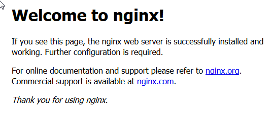

title: Installation Arch on vServer
published_date: "2018-05-04 00:00:00 +0000"
layout: default.liquid
is_draft: true
data:
  tags: "linux, arch linux, arch, server, vserver"
  humandate: 04.05.2018
---

Ist in erster Linie ein Reminder für mich, erhebt also keinen Anspruch auf Vollständigkeit oder ausführliche Erläuterungen.

Ziel: Arch absichern, LEMP installieren, Nextcloud installieren

__Arch-Server aktualisieren und absichern__

Als erstes Mirrorliste aktualisieren und optimieren (Link zu Beschreibung), anschließend System mit *pacman -Syu* aktualisieren.

Absichern siehe XXX.

__LEMP installieren__

___Install Nginx___

I use the stable version. Install:
```
sudo pacman -S nginx
```

By default, the command will also install *geoip* and *geoip-database* package. Once it’s installed, check Nginx status.
```
systemctl status nginx
```

If it’s not running, start it with systemctl:
```
sudo systemctl start nginx
```

Enable Nginx to auto-start when Arch Linux server is booted up.
```
sudo systemctl enable nginx
```

Check Nginx version:
```
nginx -v
nginx version: nginx/1.14.0
```

Enter the IP address of your Arch Linux server in the browser address bar, if you see the following text, that means Nginx is running correctly.



The default main configuration file is */etc/nginx/nginx.conf*.

___Install MariaDB___

MariaDB is provided with the mariadb package:
```
sudo pacman -S mariadb
```

We need to initialize the MariaDB data directory prior to starting the service. This can be done with *mysql_install_db* command.
```
sudo mysql_install_db --user=mysql --basedir=/usr --datadir=/var/lib/mysql
```
Now we start MariaDB.
```
sudo systemctl start mysqld
```

Check if it’s running:
```
systemctl status mysqld
```

Enable MariaDB to auto-start when Arch Linux is booted up.
```
sudo systemctl enable mysqld
```

Run the post-installation security script.
```
sudo mysql_secure_installation
```

You will be asked to enter your MariaDB root password. Since you have not a MariaDB root password yet, press enter and then set the root password. It’s also good idea to remove test database, anonymous user and disable root remote login.

Check MariaDB version.
```
mysql --version
mysql  Ver 15.1 Distrib 10.1.32-MariaDB, for Linux (x86_64) using readline 5.1
```

The default main configuration file is */etc/mysql/my.cnf*.

___Install PHP7___

Install PHP7:
```
sudo pacman -S php-fpm
```

After it’s installed, we need to tell Nginx to run PHP using php-fpm. To achieve that, edit */etc/nginx/nginx.conf* file.
```
sudo nano /etc/nginx/nginx.conf
```

Find the *location ~ \.php$* section and modify it to the following:
```
location ~ \.php$ {
            root           /usr/share/nginx/html;
            fastcgi_pass   unix:/run/php-fpm/php-fpm.sock;
            fastcgi_index  index.php;
            fastcgi_param  SCRIPT_FILENAME  $document_root$fastcgi_script_name;
            include        fastcgi_params;
}
```

Save and close the file. Then start and enable php-fpm service with the following commands:
```
sudo systemctl start php-fpm
sudo systemctl enable php-fpm
```

___Test PHP processing___

Create a *test.php* file in the web root .
```
sudo nano /usr/share/nginx/html/test.php
```

Add these lines to the file.
```
<?php
  phpinfo();
?>
```

Save and close the file. Reload Nginx.
```
sudo systemctl reload nginx
```

Now in your browser address, type *http://your-server-ip/test.php*. You should see all your PHP info.
The *test.php* file is for testing purpose only. For security reasons you can now remove it.

___Enable Extensions___

Edit */etc/php/php.ini* config file.
```
sudo nano /etc/php/php.ini
```

Find the following two lines, remove semicolons to enable these two extensions.
```
;extension=mysqli.so
;extension=pdo_mysql.so
```

Reload *php-fpm* service for the changes to take effect.
```
sudo systemctl reload php-fpm
```

*mysqli.so* is used to connect PHP with MariaDB/MySQL database. *pdo_mysql.so* is necessary to display Drupal sites. You may also need to enable imagemagick extension for PHP in order to crop and rotate images in CMS platforms such as WordPress.

Congrats! You have successfully installed Nginx, MariaDB and PHP7 on Arch Linux server!

__Setting up Nextcloud Server__

___Install Nextcloud Server on Arch Linux___

Download the NextCloud zip archive onto your server. You may need to change the version number. Go to https://nextcloud.com/install and click the download button to check out the latest version. You can download the zip archive with wget in the terminal.
```
sudo pacman -S wget
wget https://download.nextcloud.com/server/releases/nextcloud-VERSION.zip
```

Install unzip and extract it to the document root of Nginx web server. (/usr/share/nginx/).
```
sudo pacman -S unzip
sudo unzip nextcloud-VERSION.zip -d /usr/share/nginx/
```

Then let Nginx user (http) be the owner of the nextcloud directory.
```
sudo chown http:http /usr/share/nginx/nextcloud/ -R
```

___Create a Database and User in MariaDB___

Log into MariaDB database server with the following command:
```
mysql -u root -p
```

Then create a database for Nextcloud.
```
create database nextcloud;
```

Create the database user. Again, you can use your preferred name for this user. Replace your-password with your preferred password.
```
create user nextclouduser@localhost identified by 'your-password';
```

Grant this user all privileges on the nextcloud database.
```
grant all privileges on nextcloud.* to nextclouduser@localhost identified by 'your-password';
```

Flush the privileges table and exit.
```
flush privileges;
exit;
```

___Enable Binary Logging in MariaDB___

Edit the main MariaDB config file.
```
sudo nano /etc/mysql/my.cnf
```

Add the following two lines in [mysqld] section. You may find that these two lines are already there (line 54 and 57) because the MariaDB package of Arch Linux enables binary logging by default. If you cannot find them, then manually add them to the [mysqld] section of my.cnf file.
```
log-bin        = mysql-bin
binlog_format  = mixed
```

The format of binary log must be set to mixed. Save and close the file. Then restart MariaDB service.
```
sudo systemctl restart mysqld
```

___Create an Nginx Config File for Nextcloud___

First, create a *conf.d* directory for individual Nginx config files.
```
sudo mkdir /etc/nginx/conf.d
```

Then create a config file for Nextcloud.
```
sudo nano /etc/nginx/conf.d/nextcloud.conf
```

Put the following text into the file.
```
server {
    listen 80;
    server_name nextcloud.your-domain.com;

    # Add headers to serve security related headers
    add_header X-Content-Type-Options nosniff;
    add_header X-Frame-Options "SAMEORIGIN";
    add_header X-XSS-Protection "1; mode=block";
    add_header X-Robots-Tag none;
    add_header X-Download-Options noopen;
    add_header X-Permitted-Cross-Domain-Policies none;

    # Path to the root of your installation
    root /usr/share/nginx/nextcloud/;

    location = /robots.txt {
        allow all;
        log_not_found off;
        access_log off;
    }

    # The following 2 rules are only needed for the user_webfinger app.
    # Uncomment it if you're planning to use this app.
    #rewrite ^/.well-known/host-meta /public.php?service=host-meta last;
    #rewrite ^/.well-known/host-meta.json /public.php?service=host-meta-json
    # last;

    location = /.well-known/carddav {
        return 301 $scheme://$host/remote.php/dav;
    }
    location = /.well-known/caldav {
       return 301 $scheme://$host/remote.php/dav;
    }

    location ~ /.well-known/acme-challenge {
      allow all;
    }

    # set max upload size
    client_max_body_size 512M;
    fastcgi_buffers 64 4K;

    # Disable gzip to avoid the removal of the ETag header
    gzip off;

    # Uncomment if your server is build with the ngx_pagespeed module
    # This module is currently not supported.
    #pagespeed off;

    error_page 403 /core/templates/403.php;
    error_page 404 /core/templates/404.php;

    location / {
       rewrite ^ /index.php$uri;
    }

    location ~ ^/(?:build|tests|config|lib|3rdparty|templates|data)/ {
       deny all;
    }
    location ~ ^/(?:\.|autotest|occ|issue|indie|db_|console) {
       deny all;
     }

    location ~ ^/(?:index|remote|public|cron|core/ajax/update|status|ocs/v[12]|updater/.+|ocs-provider/.+|core/templates/40[34])\.php(?:$|/) {
       include fastcgi_params;
       fastcgi_split_path_info ^(.+\.php)(/.*)$;
       fastcgi_param SCRIPT_FILENAME $document_root$fastcgi_script_name;
       fastcgi_param PATH_INFO $fastcgi_path_info;
       #Avoid sending the security headers twice
       fastcgi_param modHeadersAvailable true;
       fastcgi_param front_controller_active true;
       fastcgi_pass unix:/run/php-fpm/php-fpm.sock;
       fastcgi_intercept_errors on;
       fastcgi_request_buffering off;
    }

    location ~ ^/(?:updater|ocs-provider)(?:$|/) {
       try_files $uri/ =404;
       index index.php;
    }

    # Adding the cache control header for js and css files
    # Make sure it is BELOW the PHP block
    location ~* \.(?:css|js)$ {
        try_files $uri /index.php$uri$is_args$args;
        add_header Cache-Control "public, max-age=7200";
        # Add headers to serve security related headers (It is intended to
        # have those duplicated to the ones above)
        add_header X-Content-Type-Options nosniff;
        add_header X-Frame-Options "SAMEORIGIN";
        add_header X-XSS-Protection "1; mode=block";
        add_header X-Robots-Tag none;
        add_header X-Download-Options noopen;
        add_header X-Permitted-Cross-Domain-Policies none;
        # Optional: Don't log access to assets
        access_log off;
   }

   location ~* \.(?:svg|gif|png|html|ttf|woff|ico|jpg|jpeg)$ {
        try_files $uri /index.php$uri$is_args$args;
        # Optional: Don't log access to other assets
        access_log off;
   }
}
```

Replace the content for *server_name* and *root* with the actual data. If you are setting up Nextcloud on your home computer, then enter your private IP address for the server name.

Next, edit */etc/nginx/nginx.conf* file
```
sudo nano /etc/nginx/nginx.conf
```

Add the following line (as first line) in the http section so that individual Nginx config files will be loaded.
```
include /etc/nginx/conf.d/*.conf;
```
Save and close the file. Then test Nginx configurations.
```
sudo nginx -t
```

If the test is successful, reload Nginx for the changes to take effect.
```
sudo systemctl reload nginx
```

___Troubleshooting nginx configuration___

When adding new virtual hosts in your nginx configuration file, you can experience this error message:
```
sudo nginx -t
2018/05/04 11:10:10 [warn] 479#479: could not build optimal types_hash, you should increase either types_hash_max_size: 1024 or types_hash_bucket_size: 64; ignoring types_hash_bucket_size
2018/05/04 11:10:10 [emerg] 479#479: could not build server_names_hash, you should increase server_names_hash_bucket_size: 32
nginx: configuration file /etc/nginx/nginx.conf test failed
```

*server_names_hash_bucket_size* controls the maximum length of a virtual host entry (ie the length of the domain name).
In other words, if your domain names are long, increase this parameter.

You need to add this flag in the http context (/etc/nginx/nginx.conf):
```
http {
    server_names_hash_bucket_size 64;
    ...
}
```

___Install and Enable PHP Modules___

Nextcloud requires mysql and gd modules to be enabled in order to work properly. mysql module is already installed in the previous LEMP tutorial. Now install gd module with the following command:
```
sudo pacman -S php-gd
```

Then edit *php.ini* file.
```
sudo nano /etc/php/php.ini
```

Find the following 3 lines. Remove the semicolons to enable these 3 modules.
```
;extension=gd         (line 899)
;extension=mysqli     (line 887)
;extension=pdo_mysql  (line 891)
```

Save and close the file. Then reload php-fpm process for the changes to take effect.
```
sudo systemctl reload php-fpm
```

___Nextcloud Web Installer___

Now in your browser address bar, type *nextcloud.your-domain.com* to access the Nextcloud web installer. Finish the installation.

___Get A Free SSL Certificate from Let’s Encrypt___

This step is necessary on a remote server because you want to make sure your Nextcloud username and password are not sniffed by malicious people. Skip this step if you are setting up Nextcloud on your home computer.

First we need to install the certbot client and Nginx plugin which is available in Arch Linux community repository.
```
sudo pacman -S certbot certbot-nginx
```

Then use the Nginx plugin to obtain and install a certificate for Nginx Web server like below.
```
sudo certbot --nginx --agree-tos --redirect --staple-ocsp --email your-email-address -d nextcloud.your-domain.com
```

I assume you are using a domain name like nextcloud.your-domain.com to access the ownCloud web interface. You also need to point your domain name to your server IP in DNS before running the above command.

Once the certificate is obtained and installed, reload Nginx.
```
sudo systemctl reload nginx
```

___Auto-Renew TLS Certificate___

It’s advisable to auto-renew Let’s Encrypt TLS certificate. We can achieve that with cron job. First install cronie on Arch Linux.
```
sudo pacman -S cronie
```

Then edit the crontab file of root user.
```
sudo crontab -e
```

Put the following line into the file which will try to renew your cert once per day.
```
@daily certbot renew --quiet
```

Save and close the file.

Congrats! You have successfully set up NextCloud personal cloud storage on Arch Linux with Nginx, MariaDB and PHP7.

#### Weiterführende Links:
* [Mirrors sortieren](https://wiki.archlinux.org/index.php/Mirrors#Sorting_mirrors)