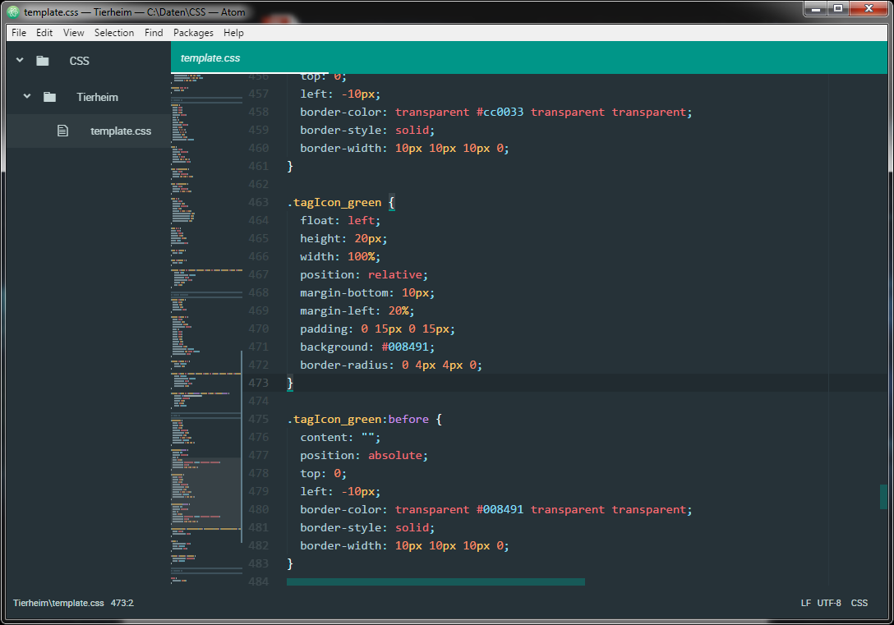
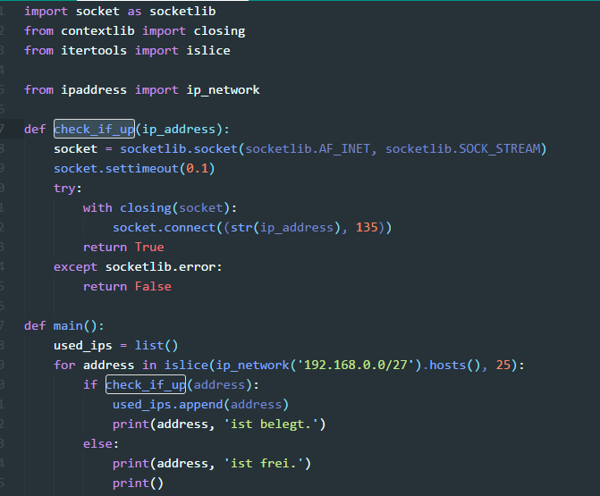

extends: default.liquid

title: Sinnvolle Erweiterungen für Atom
date:       18 Jan 2017 00:00:00 +0000
humandate:  18.01.2017
tags: atom, packages
path: 2017/atom-meaningful-extensions.html
---

__[Atom](https://atom.io/)__ lebt ja insbesondere von der guten Konfigurierbarkeit und der großen Anzahl an mehr oder weniger sinnvollen Erweiterungen (Packages). Ich werde hier nach und nach die für mich sinnvollsten Erweiterungen kurz vorstellen.

4 Erweiterungen, die ich sofort installiert habe:
* [minimap](https://atom.io/packages/minimap)
* [emmet](https://atom.io/packages/emmet)
* [highlight-selected](https://atom.io/packages/highlight-selected)
* [open-recent](https://atom.io/packages/open-recent)

## [minimap](https://atom.io/packages/minimap)

Die Erweiterung *[minimap](https://atom.io/packages/minimap)* bietet für eine geöffnete Datei eine Vorschau auf den vollständigen Inhalt und zeigt den Bereich, den man gerade sieht. Über die Vorscha kann gerade in größeren Dateien schnell navigiert werden.

__Weitere Infos:__ [minimap](https://atom.io/packages/minimap)

## [emmet](https://atom.io/packages/emmet)

*[emmet](https://atom.io/packages/emmet)* ist eine besonders für Webentwickler sehr sinnvolle Erweiterung zur schnellen Erstellung von XML-, HTML- und CSS-Code.

## [highlight-selected](https://atom.io/packages/highlight-selected)

Die Erweiterung *[highlight-selected](https://atom.io/packages/highlight-selected)* ist vor allem beim Programmieren sehr hilfreich, sie zeigt nach einem Doppelklick auf ein Wort (z.B. Funktionsname, Variable) alle anderen Vorkommen des ausgewählten Wortes in der Datei an.

## [open-recent](https://atom.io/packages/open-recent)

Die Erweiterung *[open-recent](https://atom.io/packages/open-recent)* bringt dem Atom-Editor eine Liste der zuletzt geöffneten Dateien. 
