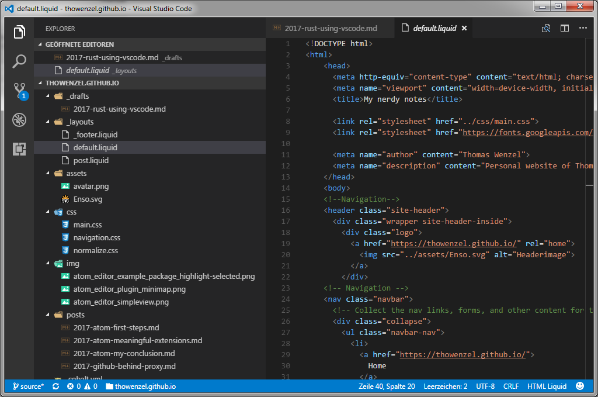
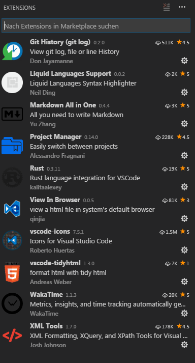

extends: default.liquid

title: Rust und Visual Studio Code
date:       06 Apr 2017 00:00:00 +0000
humandate:  06.04.2017
tags: rust, vscode
categories: Programming
path: 2017/rust-using-vscode.html
---
Wie in einem älteren Beitrag angekündigt habe, nutze ich inzwischen __[Visual Studio Code](https://code.visualstudio.com/)__.

__Visual Studio Code__ ist ein unter der MIT-Lizenz stehender Quelltext-Editor von Microsoft. Er ist für die Betriebssysteme Windows, MacOS und Linux verfügbar. Technologisch basiert __Visual Studio Code__ auf Electron (Framework) und ermöglicht auch Debugging, IntelliSense und Versionsverwaltung.

### Extensions
__Visual Studio Code__ lässt sich über das Installieren von Extensions sehr gut an die eigenen Bedürfnisse anpassen.

